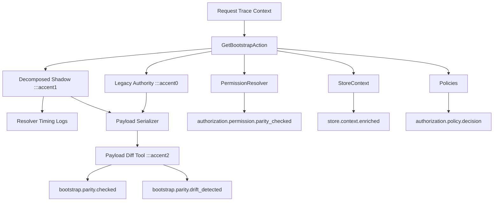

# Observability Foundations

## Purpose

This document describes the low-risk observability infrastructure introduced during the
stabilization phase.

It is intentionally additive. It does not change API contracts, authorization behavior,
bootstrap payloads, membership rules, guard behavior, or checkout logic.

## Scope

Implemented foundations:

- request correlation IDs
- request-scoped trace context
- structured logging context propagation
- database-backed audit infrastructure
- security event logging primitives
- release version tagging

Explicitly out of scope:

- bootstrap decomposition
- membership migration
- RBAC migration
- guard split
- checkout refactor
- queue or async observability
- external tracing vendors

## Correlation Lifecycle

### Header Contract

- Incoming header: `X-Correlation-ID`
- Outgoing header: `X-Correlation-ID`

### Rules

- If a valid UUID-like correlation ID is provided, it is preserved.
- If no valid correlation ID is provided, a new UUID is generated.
- The same correlation ID survives the full request lifecycle.
- The correlation ID is available in:
  - request trace context
  - structured log context
  - audit log rows
  - security event logs
  - exception responses via response headers

## Trace Context Structure

The request-scoped context is represented by `RequestTraceContext`.

Fields:

- `correlationId`
- `actorId`
- `actorType`
- `membershipId`
- `storeId`
- `apiDomain`
- `releaseVersion`
- `authDomain`
- `operationalContext`
- `onboardingRequired`
- `routeDomain`
- `routeOwnerAuthDomain`
- `routeEnforcementMode`
- `routeAllowedActorTypes`
- `sessionId`
- `sessionAuthDomain`
- `sessionActorType`
- `sessionActorId`
- `sessionAuthorityModel`
- `sessionIsolationState`
- `sessionOwnershipKey`
- `sessionOrigin`
- `sessionIntendedGuardFuture`
- `sessionOnboardingApplicable`
- `guardFutureHint`
- `guardAmbiguousOwnershipPath`
- `guardMismatchAnomaly`

### Enrichment Model

- `InitializeRequestTraceContext` initializes correlation ID, API domain, release version, and actor context when available.
- `StoreContext` enriches the trace with `storeId` and `membershipId`.
- Exception handling and loggers consume the same context without mutating business behavior.

### Important Boundary

Trace context is observability-only.

It MUST NOT:

- authorize requests
- decide store membership
- alter policies
- change controller responses
- become a hidden business dependency

## Middleware Responsibilities

### `InitializeRequestTraceContext`

- runs on API requests
- initializes request-scoped trace context
- preserves or generates correlation IDs
- sets structured log context via `Log::withContext()`
- adds `X-Correlation-ID` to successful responses

### `StoreContext`

- continues validating active store resolution
- continues binding `storeId` and `currentStore`
- additionally enriches trace context with `storeId` and `membershipId`

### `EnsureOnboardingIsCompleted`

- keeps the merchant onboarding gate authoritative
- evaluates onboarding applicability explicitly
- records onboarding evaluation telemetry
- records customer/super-admin onboarding bypass telemetry
- records a structured security event when merchant onboarding access is denied

## Logging Integration

Structured request context is propagated through Laravel logging using `Log::withContext()`.

Included fields:

- `correlation_id`
- `actor_id`
- `actor_type`
- `membership_id`
- `store_id`
- `api_domain`
- `release_version`
- `auth_domain`
- `operational_context`
- `onboarding_required`
- `route_domain`
- `route_owner_auth_domain`
- `route_enforcement_mode`
- `route_allowed_actor_types`
- `session_id`
- `session_auth_domain`
- `session_actor_type`
- `session_actor_id`
- `session_authority_model`
- `session_isolation_state`
- `session_ownership_key`

This is propagation infrastructure only.

It does not rewrite existing log statements or replace the global logger.

## Audit Infrastructure

### Storage

Audit events are persisted in the `audit_logs` table.

Columns:

- `id`
- `event`
- `actor_id`
- `actor_type`
- `membership_id`
- `store_id`
- `correlation_id`
- `ip_address`
- `user_agent`
- `metadata`
- `created_at`

### Rules

- append-only
- no updates
- no deletes
- safe metadata only
- no passwords, tokens, authorization headers, cookies, or secrets in metadata

### Usage Boundary

The audit system is available through `AuditLoggerInterface`.

This phase provides infrastructure only. It does not automatically audit every operation.

## Security Event Foundations

Supported event types:

- `auth.login.failed`
- `auth.guard.mismatch`
- `auth.onboarding.denied`
- `tenant.store_mismatch`
- `authorization.denied`

Current safe integrations:

- onboarding denial
- invalid credentials
- store context mismatch / unauthorized store access
- authorization denial exceptions

Security events are logged with safe metadata and request trace context. They are not yet
wired to alerting, dashboards, or SIEM integrations.

## Wave 3A Identity Telemetry

Wave 3A extends observability with identity-bound structured events.

### Route/Domain Events

- `identity.customer_route.accessed`
- `identity.actor_domain.mismatch`
- `identity.cross_context.denied`
- `identity.merchant_route.misused`

### Onboarding Context Events

- `identity.onboarding.evaluated`
- `identity.onboarding.bypassed`

### Session Preparation Events

- `identity.session_boundary.annotated`
- `session.ownership.resolved`
- `auth.guard.transitional_resolution`
- `auth.guard.split_simulation`
- `auth.guard.split_mismatch_detected`
- `auth.guard.illegal_fallback_detected`
- `guard.shadow.resolved`
- `guard.shadow.ambiguity_detected`
- `guard.shadow.mismatch_detected`
- `session.contamination.cross_domain_detected`
- `session.contamination.route_domain_detected`
- `session.contamination.actor_context_detected`
- `session.contamination.onboarding_leakage_detected`
- `session.contamination.session_origin_ambiguity_detected`
- `session.contamination.future_guard_ambiguity_detected`
- `session.contamination.bootstrap_misuse_detected`
- `session.contamination.logout_ambiguity_detected`
- `session.contamination.severity_assessed`
- `session.logout.ownership_traced`
- `session.csrf.ownership_traced`

These events remain diagnostic telemetry, but the runtime now also enforces explicit guard selection and session-contamination rejection on enforced non-transitional routes. Treat the logs as evidence of the active ownership model, not as the enforcement mechanism itself.

## Wave 3C Guard Split Validation Signals

Wave 3C adds simulation-driven validation and scoring artifacts on top of Wave 3B telemetry.

Operational focus areas:

- concurrent session collision risk
- csrf ownership drift risk
- logout propagation risk
- bootstrap ownership conflicts
- browser multi-tab risk
- mobile-client split risk
- frontend unsupported assumption detection

Wave 3C does not activate a split. It only expands readiness evidence.

## Release Marker Support

Release version is sourced from `config/observability.php` via `APP_RELEASE_VERSION`.

It is attached to:

- trace context
- structured logs
- security events
- audit records

## Future Integration Points

These foundations are intended to support later roadmap phases without rework:

- parity telemetry for bootstrap decomposition
- migration cutover auditing
- tenant isolation incident correlation
- authorization drift detection
- rollback and release impact analysis

## Wave 2 Boundary Normalization Telemetry

Wave 2 extends the observability foundation without changing public behavior.

### Bootstrap Telemetry Streams

Structured events emitted during bootstrap normalization:

- `bootstrap.resolution.started`
- `bootstrap.resolution.completed`
- `bootstrap.resolver.timed`
- `bootstrap.dependencies.profiled`
- `bootstrap.parity.checked`
- `bootstrap.parity.counter`
- `bootstrap.parity.drift_detected`

Expected context fields:

- `bootstrap_response_version`
- `bootstrap_resolver_version`
- `bootstrap_authority_path`
- `bootstrap_resolver_timings_ms`
- `shadow_path`
- `drift_count`
- `diff_paths`
- `sections_requested`
- `section_presence`
- `resolver_timing_distribution`
- `store_count_distribution`
- `permission_payload_size_distribution`
- `bootstrap_payload_size_growth`
- `flag_state`

### Membership & Store Context Telemetry

Wave 2 adds structured membership-aware enrichment telemetry:

- `store.context.enriched`

Expected context fields:

- `store_id`
- `membership_id`
- `membership_role`
- `membership_source`

This remains observability-only. It does not authorize store access.

### Permission Resolution Telemetry

Wave 2 permission normalization emits:

- `authorization.permission.resolved`
- `authorization.permission.parity_checked`
- `authorization.permission.drift_detected`

Expected context fields:

- `authority`
- `resolution_path`
- `store_id`
- `membership_id`
- `membership_role`
- `store_scoped`
- `super_admin_bypass`
- `capabilities`
- `drift_count`

### Policy Decision Telemetry

Wave 2 policy normalization foundations emit:

- `authorization.policy.decision`

Expected context fields:

- `policy`
- `ability`
- `capability`
- `result`
- `allow`
- `deny`
- `actor_id`
- `actor_context`
- `store_context`
- `subject_type`

This telemetry is additive. It does not change policy outcomes.

### Drift Detection Surface

Wave 2 also introduces a CI-safe warning-mode detector via:

- `php artisan architecture:detect-authorization-drift`

Initial detections:

- `auth()` inside `Actions`
- `hasPermissionTo()` outside policies/resolvers
- controller authorization paths still coupled to generic `currentStore`
- admin route permission middleware drift
- bootstrap boundary coupling
- request/session coupling
- repository leakage

This is a governance aid, not a hard-fail control in Wave 2.

### Drift Triage Artifacts

Wave 2 stabilization hardening adds machine-readable drift triage support.

Supported artifacts:

- current drift report JSON
- allowlist-aware drift report JSON
- baseline snapshot JSON
- regression comparison between current and baseline findings

Expected drift fields:

- `fingerprint`
- `category`
- `type`
- `severity`
- `file`
- `line`
- `message`
- `allowlisted`
- `regression`

### Policy Ownership Visibility Artifacts

Wave 2 adds an exportable ownership report via:

- `php artisan architecture:report-policy-ownership`

Expected report fields:

- `route_uri`
- `route_name`
- `methods`
- `controller`
- `controller_method`
- `policy_used`
- `capability_used`
- `store_aware`
- `generic_currentStore`
- `hidden_fallback`
- `authorization_calls`
- `request_authorize_strategies`

### Operational Readiness Artifact

Wave 2 adds a machine-readable readiness artifact via:

- `php artisan architecture:wave2-readiness-report`

Expected sections:

- `bootstrap_parity_health`
- `resolver_stability`
- `drift_counts`
- `drift_trend`
- `tenant_isolation_status`
- `policy_instrumentation_coverage`
- `observability_health`
- `wave3_gate`

### Wave 2 Parity Telemetry Flow

